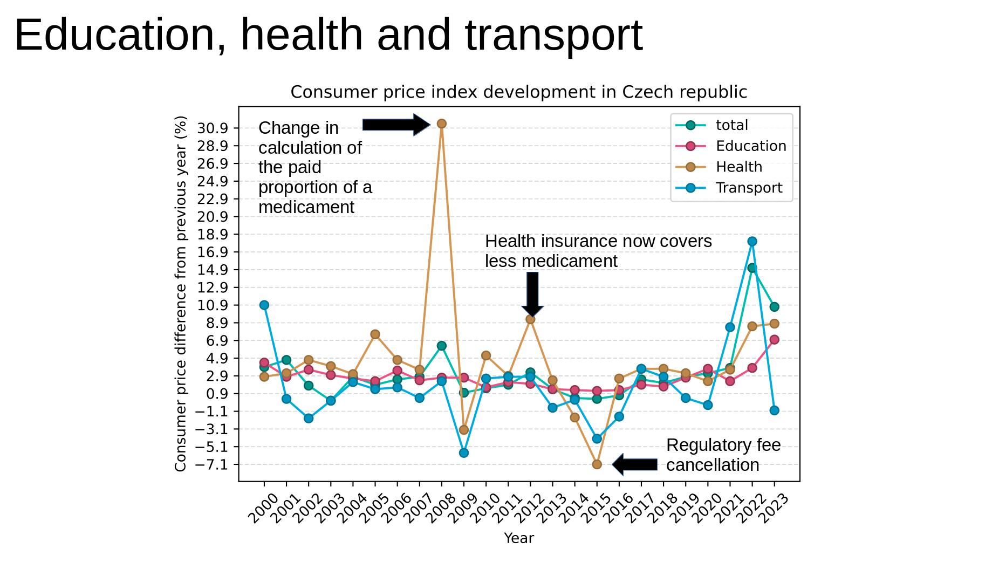
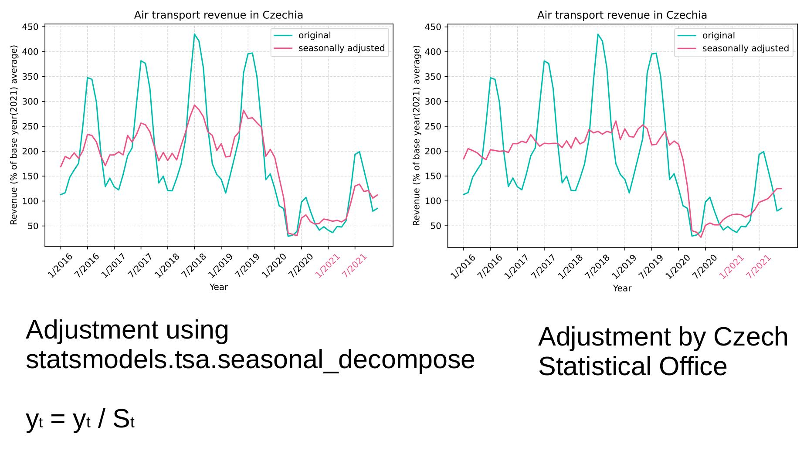
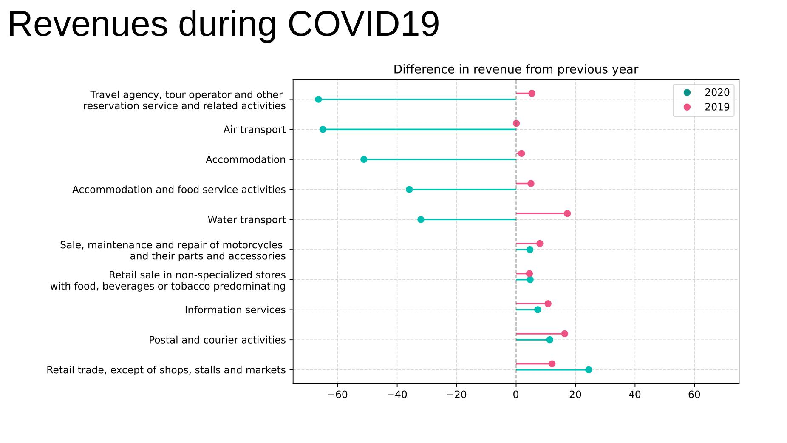
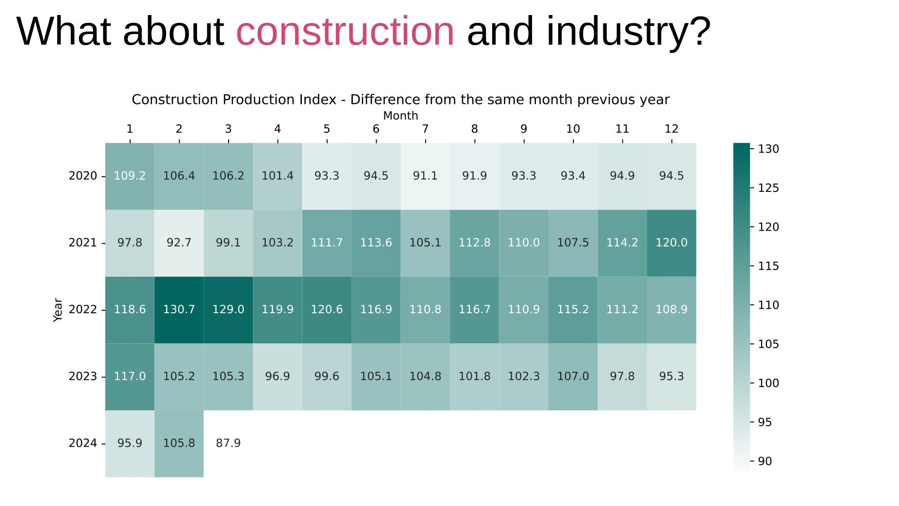
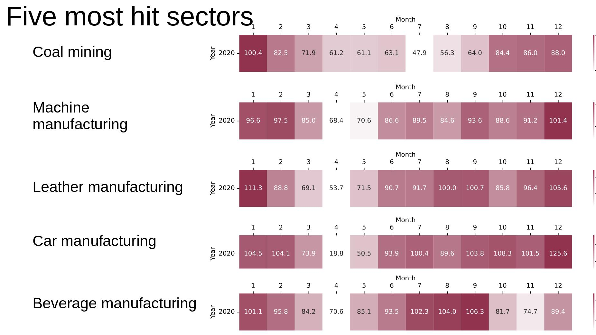

I was giving a short presentation on the topic of consumer prices, industry and construction growth and retail revenues in Czechia during one of my university courses.
This repository contains the presentation, along with my notebook where I generated the necessary visualizations.
Below you can see some of the slides.

